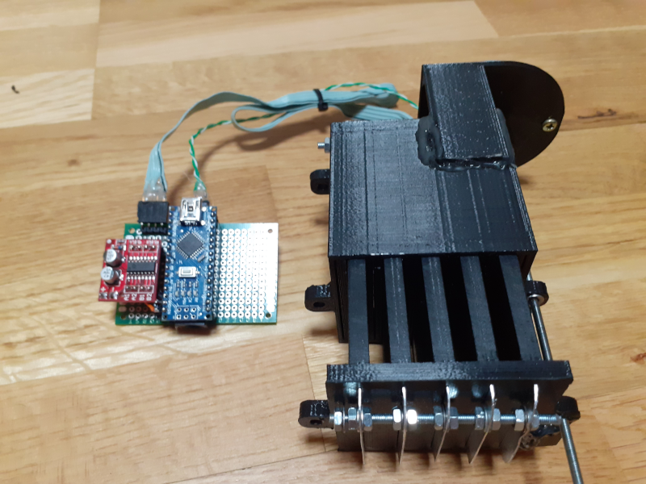

# Magnetic loop antenna capacitor controller
Magnetic loop antenna capacitor KISS (keep it simple stupid) controller based on 
 - Arduino Nano
 - L298N stepper driver
 - EM-290 stepper from Epson printer
 - HC-06 bluetooth serial controller for remote control
 - 3d printed slide capacitor printed with PETG plastic
   - Plate sizes are 50x60 mm
   - Plate spacing 5 mm
   - 11 plates
   - Worm gear is M3
   - Can handle 100W CW without arcing (tested with 0.9m loop)
   - Capacitance range ~3-95 pF
   - Can tune from ~9 up to 29 MHz with 0.9m loop

# Serial commands
On successful command execution "ok" is returned when operation was successfully completed or "err" if command was unsuccessful. Next commands are supported:
 - *p*: park to initial 0 position, automatically performed when powered on
 - *c*: start calibration procedure, each time capacitor goes into new position you need to type frequency where resonance occurs, calibration is done across 10 points and then linear interpolation is used to find position based on input frequency, calibration points are stored in EEPROM after completion and loaded when powered on
 - *u*: go/tune up to higher frequency
 - *d*: go/tune down to lower frequency
 - *number*, frequency in kHz where to move capacitor, should be used after calibration procedure completion

# Configuration parameters (capctrl.h)
 - *ConfigSpeed*: stepper speed, default is 64
 - *ConfigStep*: number of steps for tune up/down commands, default is 100
 - *ConfigMaxPos*: end position of capacitor, maximum number of steps, default is 5200
 - *ConfigCalPoints*: number of calibration points, default is 10
 - *ConfigCalAddr*: EEPROM start address where calibration data is stored, default is 0x0
